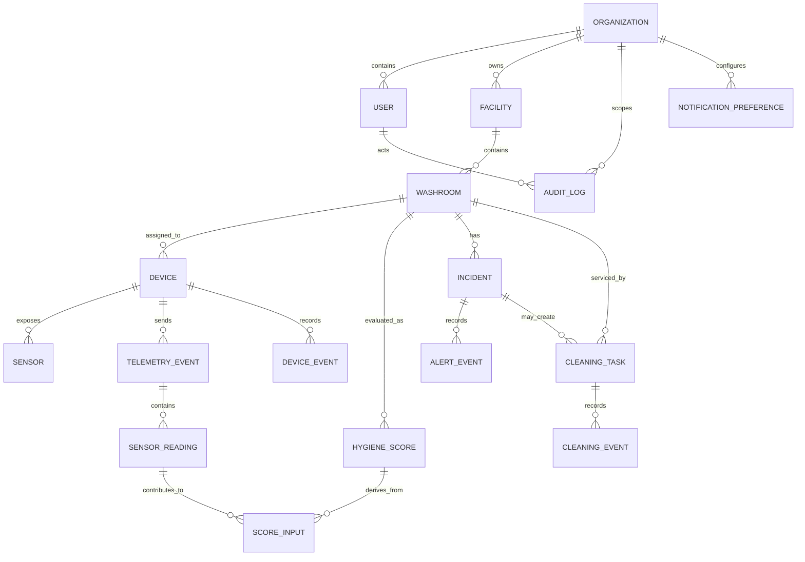

# Phase 5 — Domain model and API contract

**Status:** Initial contract for Phase 6 backend implementation and later ESP32 integration.

**Purpose:** Establish stable identifiers, event semantics, units, routes, access rules and error behavior before backend and firmware are built. This is a planned v1 contract; revisions should be recorded in the decision log and OpenAPI file.

## 1. Contract principles

- API prefix: `/api/v1`; timestamps are RFC 3339 UTC; entity identifiers are UUIDs.
- Server-generated `received_at`, source mode, organization scope, score, cause and alert fields are authoritative. A device cannot assign itself to another organization or assert a derived hygiene state.
- Raw observations are preserved separately from normalized readings and derived records. Every computed score references input readings and an algorithm version.
- Telemetry is append-only. Retried requests are idempotent using `(device_id, sequence)`; the same key with different content is a conflict and is never silently overwritten.
- Hardware telemetry is authenticated as a device. Simulation records are generated by a trusted simulator/server identity and stored with `source_mode=simulation`. Public clients cannot submit `sample` or label arbitrary telemetry as live.
- Sensor fields are optional per device capability. Missing/invalid/stale sensor inputs are explicit quality states, not zero values.
- MQ sensor measurements are raw ADC/voltage and optionally a relative calibrated index. No unsupported ppm field is part of v1.
- Existing `/api/ingest` is retained as a compatibility alias if in use. It invokes the same validation and service as `/api/v1/telemetry`; it does not maintain a separate implementation.

## 2. Domain model

### Entity relationship overview



### Tables/entities

| Entity | Key fields and semantics |
|---|---|
| `organizations` | `id`, `name`, `status`, `created_at`, `updated_at`; tenant boundary |
| `facilities` | `id`, `organization_id`, `name`, `timezone`, `address` (optional), status |
| `users` | `id`, `organization_id` (nullable only for platform Super Admin), normalized unique email, password hash, role, status, timestamps |
| `washrooms` | `id`, `facility_id`, `name`, location label, status, capability summary, timestamps |
| `devices` | `id`, `washroom_id`, `device_key_hash`, status, firmware version, last seen, credential revocation/rotation timestamps, created/updated timestamps |
| `sensors` | `id`, `device_id`, stable `sensor_key`, model/type, measurement capability, unit, GPIO/interface metadata (optional), calibration metadata, status; unique `(device_id, sensor_key)` |
| `telemetry_events` | `id`, `device_id`, `sequence`, `observed_at`, `received_at`, firmware version, trusted `source_mode`, payload hash, validation result; unique `(device_id, sequence)` |
| `sensor_readings` | `id`, `telemetry_event_id`, `sensor_id` (nullable for unknown key retained for inspection), metric key, `raw_value`, `normalized_value`, unit, quality, observed/received times, metadata JSON; append-only |
| `hygiene_scores` | `id`, `washroom_id`, score nullable, classification, algorithm version, quality, calculated time, source mode, explanation JSON; append-only snapshots |
| `score_inputs` | join from score to source readings plus contribution/weight and rule explanation; supports reproducibility |
| `incidents` | `id`, `washroom_id`, type, severity, status, opened/updated/resolved times, summary, deduplication key, evidence window |
| `alert_events` | `id`, `incident_id`, event type (`created`, `acknowledged`, `resolved`, `reopened`), actor/system, timestamp, note, metadata |
| `cleaning_tasks` | `id`, `washroom_id`, optional `incident_id`, title, assignee user, state, due/start/completion times, created/updated times |
| `cleaning_events` | `id`, `task_id`, actor, event type, event time, notes, human-reported evidence metadata; append-only timeline |
| `device_events` | `id`, `device_id`, event type, event time, details; online/offline, firmware and sensor faults |
| `audit_logs` | `id`, organization, actor/system, action, resource type/id, timestamp, outcome, redacted metadata; append-only |
| `notification_preferences` | `id`, organization/user scope, channels, event preferences, quiet hours, timestamps |

All tenant-owned tables must have organization scope directly or through a required foreign-key path that is enforced by authorization queries. Use foreign keys and indexes. Delete/deactivation semantics should preserve audit and operational history; avoid hard-deleting telemetry in normal application flows.

### Enumerations

- `source_mode`: `live_hardware`, `simulation`, `sample` (server-assigned; sample fixtures are not production telemetry).
- `quality`: `valid`, `stale`, `missing`, `invalid`, `warming_up`, `uncalibrated`.
- `washroom_classification`: `clean`, `moderate`, `dirty`, `cleaning`, `offline`, `unknown`.
- `device_status`: `online`, `offline`, `degraded`, `revoked`, `unknown`.
- `incident_status`: `open`, `acknowledged`, `resolved`.
- `task_status`: `assigned`, `in_progress`, `completed`, `cancelled`.
- `role`: `super_admin`, `facility_admin`, `maintenance_staff`, `viewer`.

Do not encode state only as color or numeric score. `score=null` with `classification=unknown` is valid and preferred when inputs are insufficient.

## 3. Units and timestamp rules

- Device `observed_at` must include a timezone and be converted/stored as UTC. API responses serialize UTC using `Z`.
- `received_at` is generated by the API and cannot be supplied/overridden by the device.
- Keep `observed_at` and `received_at` separately to calculate delay and detect clock problems.
- Sensor metric keys and units are explicit: `temperature_c` (°C), `relative_humidity_pct` (% RH), `pressure_pa` (Pa), `gas_resistance_ohm` (Ω), `analog_raw` (ADC counts), `pin_voltage_v` (V), `relative_index` (dimensionless, calibration metadata required).
- No `ppm` metric is accepted for MQ-135/MQ-3 in v1. Unknown units are rejected or quarantined, not guessed.
- Validate finite numbers, configured physical/input ranges and device clock skew. Initial skew bounds are configuration decisions; rejected payloads return a specific validation code.
- An absent sensor observation means missing input; it is different from a reported numerical zero.

## 4. Telemetry request contract

`POST /api/v1/telemetry` accepts device-authenticated JSON. The trusted device credential determines the device and its organization/washroom association. Body `device_id` is optional for convenience; if present it must match the authenticated identity.

```json
{
  "device_id": "2b35667d-96e6-4d67-bd48-9a48636f0355",
  "sequence": 1842,
  "observed_at": "2026-09-30T10:20:00Z",
  "firmware_version": "0.1.0",
  "observations": [
    {"sensor_key": "bme680", "metric": "temperature_c", "value": 26.4, "unit": "Cel", "quality": "valid"},
    {"sensor_key": "bme680", "metric": "relative_humidity_pct", "value": 63.0, "unit": "%", "quality": "valid"},
    {"sensor_key": "mq135", "metric": "analog_raw", "value": 1146, "unit": "count", "quality": "uncalibrated", "metadata": {"adc_bits": 12}}
  ]
}
```

Response is `202 Accepted` after validated acceptance and durable write (or an equivalent transactional outbox guarantee):

```json
{
  "telemetry_event_id": "541a4e9f-26f4-42b9-9f00-4e16c45d1bd0",
  "device_id": "2b35667d-96e6-4d67-bd48-9a48636f0355",
  "sequence": 1842,
  "received_at": "2026-09-30T10:20:02Z",
  "source_mode": "live_hardware",
  "duplicate": false
}
```

Same device+sequence and same normalized payload hash returns `202` with the original event ID and `duplicate=true`. Same key with different payload returns `409 idempotency_conflict`. Device cannot choose `source_mode`, organization, washroom, score or incident state.

## 5. API route catalog

All routes except health endpoints use `/api/v1`. Session endpoints use secure HttpOnly same-site cookies; browser mutations also require the configured CSRF protection. Device telemetry uses a device-specific credential (initial contract: `X-Device-Key`; store only a hash server-side). Role and tenant scope are checked server-side.

| Method and path | Access | Purpose / response |
|---|---|---|
| `POST /auth/login` | Public, throttled | Validate credentials; set session cookie; return user summary |
| `POST /auth/logout` | Session + CSRF | Revoke session and clear cookie; `204` |
| `POST /auth/refresh` | Refresh session + CSRF | Rotate session; return user/session metadata |
| `POST /auth/password-reset/request` | Public, throttled | Generic accepted response without account enumeration |
| `POST /auth/password-reset/confirm` | One-time reset token | Set password and revoke old sessions |
| `GET /auth/me` | Session | Current user, role and organization scope |
| `POST /telemetry` | Device credential | Validate and persist telemetry; `202` |
| `GET /dashboard` | Session | Scoped summary, source state, data freshness and washroom summaries |
| `GET /washrooms` | Session | Filtered/paginated washroom summaries |
| `POST /washrooms` | Super/Facility Admin | Create washroom in an authorized facility |
| `GET /washrooms/{id}` | Session, tenant scoped | Washroom detail and latest score/input status |
| `PATCH /washrooms/{id}` | Super/Facility Admin | Update allowed metadata; audit changes |
| `GET /washrooms/{id}/history` | Session, tenant scoped | Readings, scores and state history for selected interval |
| `GET /sensors/{id}` | Session, tenant scoped | Sensor metadata, current quality/value and health |
| `GET /sensors/{id}/history` | Session, tenant scoped | Sensor time series |
| `GET /alerts` | Session | List/filter incidents in authorized scope |
| `POST /alerts/{id}/acknowledge` | Super/Facility Admin/Maintenance Staff | Acknowledge; actor and time recorded |
| `POST /alerts/{id}/resolve` | Super/Facility Admin; policy may permit assigned staff | Resolve with required resolution note; audit event |
| `GET /cleaning/tasks` | Session | Filter tasks by status/assignee/location |
| `POST /cleaning/tasks` | Super/Facility Admin | Create and optionally assign task/link incident |
| `GET /cleaning/tasks/{id}` | Session, scoped | Task and event timeline |
| `POST /cleaning/tasks/{id}/start` | Assigned staff/Admin | Transition assigned → in progress |
| `POST /cleaning/tasks/{id}/complete` | Assigned staff/Admin | Complete with note; record available evidence separately |
| `POST /cleaning/tasks/{id}/cancel` | Admin | Cancel with reason |
| `GET /analytics` | Session | Aggregated scoped measures; explicit period and aggregation |
| `GET /devices` | Session | Device inventory and last-seen/health in scope |
| `POST /devices` | Super/Facility Admin | Provision device; credential returned once via secure response |
| `GET /devices/{id}` | Session, scoped | Device, firmware, sensor capability and events |
| `POST /devices/{id}/revoke` | Super/Facility Admin | Revoke device credential; audit event |
| `GET /users` | Super/Facility Admin | Scoped user list |
| `POST /users` | Super/Facility Admin | Invite user with permitted role/scope |
| `GET /settings` | Session | Scoped settings and currently active rule version |
| `PATCH /settings` | Super/Facility Admin | Update approved settings; changes versioned/audited |
| `GET /audit-logs` | Super/Facility Admin, scoped | Paginated, filterable audit events; read-only |
| `GET /health` | Public/internal | Process liveness only; no sensitive detail |
| `GET /ready` | Internal/monitor | Readiness, including required dependency availability; redact public details |

### Query conventions

- List endpoints: `page` (1-based, default 1), `page_size` (default 50, max 200), stable sort, optional filters.
- Time-series endpoints: `from` and `to` RFC 3339 UTC, `interval` chosen from server-supported aggregation values, optional `metric` and `source_mode` filters.
- Reject invalid ranges, `from >= to`, too-large ranges without aggregation, and unauthorized object IDs with safe errors.
- Response pagination includes `items`, `page`, `page_size`, `total` (where affordable) and `has_more`.
- Use `Idempotency-Key` for user-created operational actions where client retries could duplicate records; telemetry uses device sequence.

## 6. Error format

Use `application/problem+json` (RFC 9457 style) with stable machine code and request trace ID:

```json
{
  "type": "https://api.example.invalid/problems/validation-error",
  "title": "Telemetry payload is invalid",
  "status": 422,
  "code": "invalid_unit",
  "detail": "The unit is not supported for this metric.",
  "instance": "/api/v1/telemetry",
  "request_id": "req_01J8...",
  "errors": [{"field": "observations[2].unit", "message": "Expected count for analog_raw."}]
}
```

Expected status codes: `400` malformed request; `401` unauthenticated; `403` forbidden; `404` unknown/inaccessible resource (avoid cross-tenant disclosure); `409` conflict/idempotency conflict/invalid transition; `413` payload too large; `415` unsupported media type; `422` schema/domain validation; `429` rate limited; `500` unexpected server error; `503` required dependency unavailable. Do not return stack traces, secrets or unredacted request credentials.

## 7. Security and tenant-scope contract

- Browser auth cookie: Secure, HttpOnly, SameSite; explicit expiration, rotation and revocation. CSRF protection for state-changing browser requests.
- Device key: unique per device, high entropy, shown only during provisioning, stored hashed, revocable/rotatable. Future mTLS may replace or complement it after a documented decision.
- Every user query and mutation is organization-scoped. Do not trust organization IDs from client payloads as authorization.
- Use TLS in deployed environments, strict CORS allowlist, request size limits, rate limits and audit for privilege/settings/incident/device changes.
- Redact credentials, reset tokens, session cookies and sensitive payloads from logs.
- The frontend access policy is a usability feature only; backend authorization is mandatory.

## 8. Versioning and compatibility

- `/api/v1` is the versioned public application contract. Add optional fields compatibly; do not silently change unit, meaning or enum semantics.
- `/api/ingest` compatibility alias accepts the v1 telemetry schema during transition. If an older firmware payload needs a legacy adapter, isolate and version it, log its use, and define a removal date before implementation.
- Persist engine version and schema version with derived output. Algorithm changes create new score records; they do not rewrite historical observations.
- Generate/update OpenAPI in the same change as route/schema changes and keep request/response fixtures under source control.

## 9. Decisions still required before production

1. Raw and derived telemetry retention period and aggregation/downsampling policy.
2. Maximum supported query period, ingestion frequency and number of devices per organization.
3. Device clock-skew allowance, offline queue maximum and replay window.
4. Final task/alert transition policy (including whether assigned staff may resolve incidents).
5. Final sensor keys and metadata after bench verification of BME680, MQ-135 and any MQ-3.
6. Organization/facility deployment scale, notifications provider and export format.
7. Approved score rules, thresholds and calibration evidence; this contract deliberately does not declare them scientifically validated.

## 10. Phase 5 completion checklist

- [x] Entity inventory and relationships documented.
- [x] Telemetry fields, provenance, units, time and idempotency documented.
- [x] API routes, access expectations, pagination and errors documented.
- [x] `/api/ingest` compatibility strategy documented.
- [x] OpenAPI 3.1 contract added at `backend/openapi.yaml`.
- [x] Security and tenant-scope behavior defined for backend implementation.
- [ ] Review the contract against any existing firmware payload if available.
- [ ] Confirm retention, scale and role-action decisions before production deployment.
